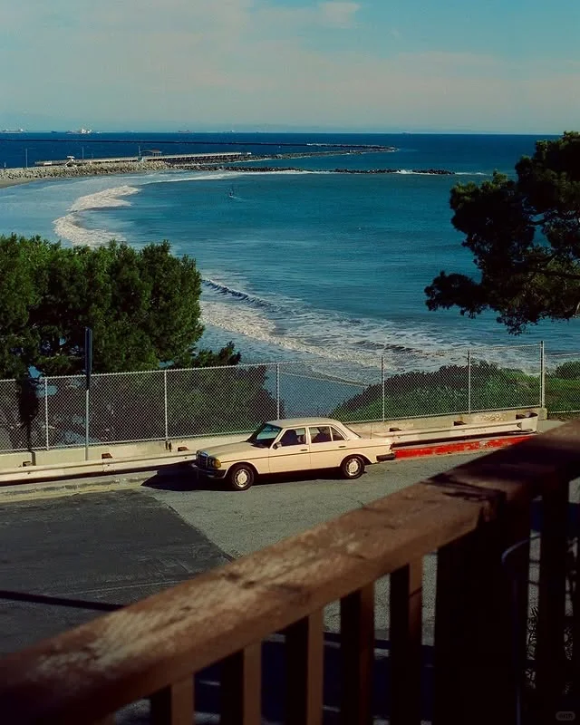
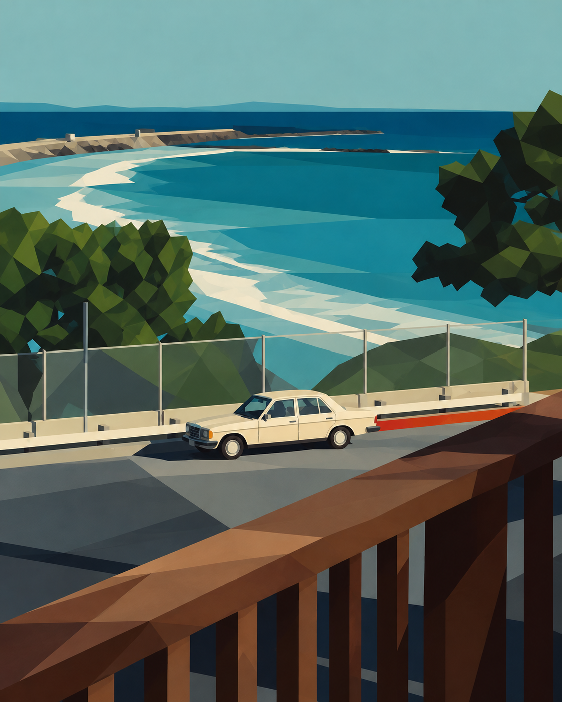

# My Skills

我制作并持续改进的 AI 技能合集。

## 几何拼贴海报

将照片转化为几何色块组成的海报，保留原图的主体构图、主要配色与空间层次。

技能文件：[geometric-collage-poster](skills/geometric-collage-poster/SKILL.md)

### 能做什么

- 保留主体位置、相对大小、前后关系和画幅比例。
- 用矩形、梯形、三角形和不规则多边形概括画面。
- 天空、水面等连续区域优先使用完整的大色块，减少无必要的三角切分。
- 用几何切面和明暗色块保留必要的体积感。
- 默认生成一张无文字、无边框的海报。

### 适合的图片

风景、街景、建筑、静物和产品照片。

目前已用海边小屋、海湾汽车和冰箱饮料瓶照片进行人工效果测试。其他题材的表现仍需继续验证。

## 效果展示

以下示例展示了保留主体构图、简化天空与海面色块的转换效果。

| 原图 | 几何拼贴海报 |
| --- | --- |
|  |  |

### 使用条件

需要能够读取图片和技能文件、并具备图像生成或编辑工具的 AI 环境。

本仓库提供工作指令，不包含图像生成模型或 API 密钥。实际生成能力、费用和限制取决于使用的平台。

### 快速开始

1. 在本仓库首页点击 **Code → Download ZIP**，下载并解压。
2. 找到 `skills/geometric-collage-poster/SKILL.md`。
3. 在支持读取本地文件的 AI 工具中，上传待处理图片，并提供该文件在自己电脑上的实际路径。

示例请求：

> 请读取我提供的 SKILL.md，按照其中的规则，将上传的图片转换为几何拼贴海报。保留主体构图和配色，以几何色块概括画面。

也可以将 SKILL.md 作为附件与图片一起提供给支持文件上传和图像编辑的工具。

### 风格说明

以纯色色块为主，允许轻微色调变化；保留必要的透视、遮挡和几何明暗层次。

默认“无文字”也会影响原图中的包装标签等文字，它们可能被概括为色带。如果需要保留文字，请在请求中明确说明。

输出通常为位图，不保证得到可编辑的矢量文件。效果可能随模型和输入图片变化，也可能出现局部纹理、渐变或构图偏移。

### 反馈

欢迎通过仓库的 Issues 提交问题或改进建议，请附上使用要求和具体偏差。
